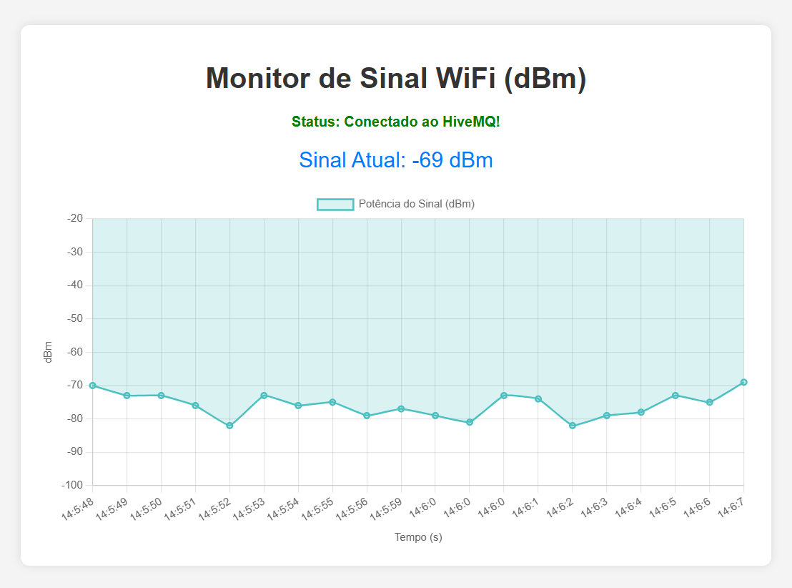

# Monitoramento_Wi-Fi
Este projeto consiste em um sistema IoT para monitoramento da qualidade do sinal WiFi utilizando um ESP32. Os dados são coletados e enviados via protocolo MQTT para um broker na nuvem (HiveMQ Cloud) e visualizados em uma Dashboard Web com gráficos em tempo real.

## Arduino IDE
Este codigo é responsavel por conectar o ESP32 à internet e enviar os dados do sinal Wi-Fi naquele local ao broker MQTT a cada 1 segundo.

``` C++
#include <WiFi.h>
#include <WiFiClientSecure.h>
#include <PubSubClient.h>

const char* ssid = "Inteli.Iot"; 
const char* password = "%(Yk(sxGMtvFEs.3";

const char* mqtt_server = "ce8024cdd8084f91b9f0e896819b210b.s1.eu.hivemq.cloud"; 
const int mqtt_port = 8883; 
const char* mqtt_user = "hivemq.webclient.1764252624556"; 
const char* mqtt_password = "4&rl3%a?iMRx5SO,yYJ6";

const char* topic_publish = "inteli/projeto/rssi";

WiFiClientSecure espClient;
PubSubClient client(espClient);

unsigned long lastMsg = 0;
#define MSG_BUFFER_SIZE  50
char msg[MSG_BUFFER_SIZE];

void setup_wifi() {
  delay(10);
  Serial.println();
  Serial.print("Conectando-se a ");
  Serial.println(ssid);

  WiFi.mode(WIFI_STA);
  WiFi.begin(ssid, password);

  while (WiFi.status() != WL_CONNECTED) {
    delay(500);
    Serial.print(".");
  }

  Serial.println("");
  Serial.println("WiFi conectado");
  Serial.print("Endereço IP: ");
  Serial.println(WiFi.localIP());
}

void reconnect() {
  while (!client.connected()) {
    Serial.print("Tentando conexão MQTT...");
    String clientId = "ESP32Client-";
    clientId += String(random(0xffff), HEX);
    
    if (client.connect(clientId.c_str(), mqtt_user, mqtt_password)) {
      Serial.println("conectado ao HiveMQ!");
    } else {
      Serial.print("falhou, rc=");
      Serial.print(client.state());
      Serial.println(" tentando novamente em 5 segundos");
      delay(5000);
    }
  }
}

void setup() {
  Serial.begin(115200);
  setup_wifi();
  
  espClient.setInsecure(); 
  client.setServer(mqtt_server, mqtt_port);
}

void loop() {
  if (!client.connected()) {
    reconnect();
  }
  client.loop();

  unsigned long now = millis();
  if (now - lastMsg > 1000) {
    lastMsg = now;
    
    long rssi = WiFi.RSSI();

    Serial.print("Sinal WiFi (dBm): ");
    Serial.println(rssi);

    snprintf (msg, MSG_BUFFER_SIZE, "%ld", rssi);
    
    client.publish(topic_publish, msg);
  }
}
```

## Gaiola de Faraday
O objetivo central deste experimento é demonstrar, na prática, o princípio da Gaiola de Faraday e seu impacto na comunicação de dispositivos IoT. Utilizando a estrutura metálica de um elevador como barreira eletromagnética, analisaremos como a atenuação severa do sinal Wi-Fi afeta a transmissão de pacotes MQTT e validaremos a capacidade do sistema de recuperar a conexão automaticamente após o bloqueio.

**Procedimento:**
1. Iniciamos com o ESP32 conectado ao Wi-Fi no corredor, onde o sinal é forte. O dashboard já está rodando e plotando os dados recebidos.
2. Entramos no elevador com o dispositivo. Enquanto a porta está aberta, a comunicação se mantém.
3. No momento em que a porta de metal se fecha, criamos uma Gaiola de Faraday. As ondas de rádio do Wi-Fi são bloqueadas pela estrutura metálica, impedindo que o ESP32 se comunique com o roteador externo.
4. No dashboard, isso será visualizado como uma interrupção súbita no envio de dados.
5. Ao sair do elevador, o sistema sai do isolamento. O código de reconexão automática entra em ação e o gráfico volta a ser gerado.

## Dashboard Web


## Demonstração em Vídeo
Link para o vídeo: [Clique Aqui](https://drive.google.com/file/d/1jYefu8E-ioJwsuLP1aixbJ7pVRKq5YnW/view?usp=sharing)
